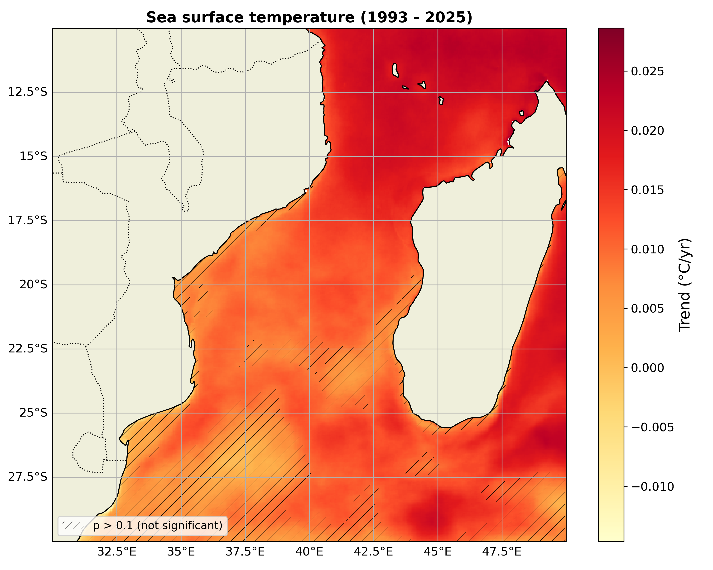
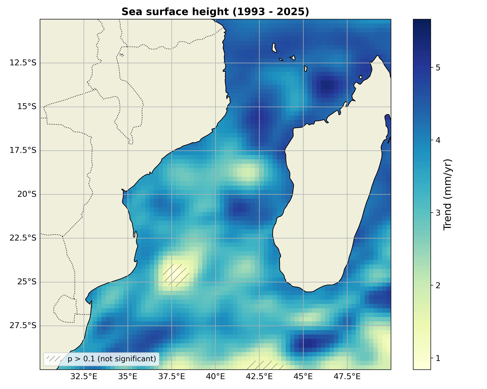

# Python-based analysis of long-term ocean trends using satellite data, developed for climate reporting applications.

**Overview**   
Pixel-wise trend analysis of sea surface temperature (SST) and sea surface height (SSH) using HAC-corrected regression. The analysis focuses on long-term climate variability in the Southwest Indian Ocean.  

**Data**  
- Source: Copernicus Marine Service  
- SST: https://data.marine.copernicus.eu/viewer/expert?view=dataset&dataset=SST_GLO_SST_L4_REP_OBSERVATIONS_010_024  
- SSH: https://data.marine.copernicus.eu/viewer/expert?view=dataset&dataset=SEALEVEL_GLO_PHY_CLIMATE_L4_MY_008_057  

**Domain**  
- Region: 10°–30°S, 30°–50°E  
- Time range: 01/01/1993 – 31/12/2025  

**Methods**  
- Pixel-wise linear regression  
- HAC (heteroskedasticity and autocorrelation consistent) correction  
- Time-series analysis  

### How to Run

1. Download Copernicus datasets (links above)
2. Open the notebook `ocean_trend_analysis.ipynb`
3. Run all cells to reproduce analysis and figures

**Requirements:**
- Python 3.x
- xarray, numpy, matplotlib

**Context**  
Analysis contributed to climate reporting work with the Norwegian Meteorological Institute and Instituto Nacional de Meteorologia (Mozambique).

### Sea Surface Temperature Trend

### Sea Surface Height Trend

